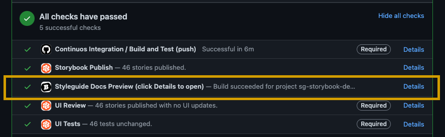
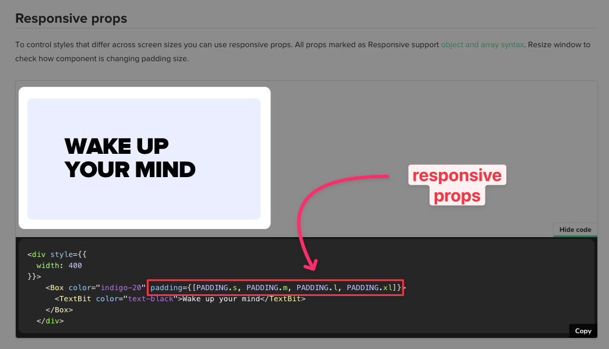
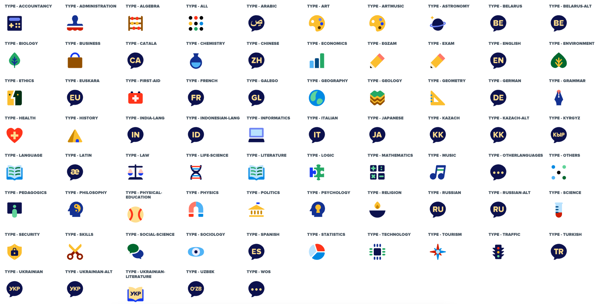
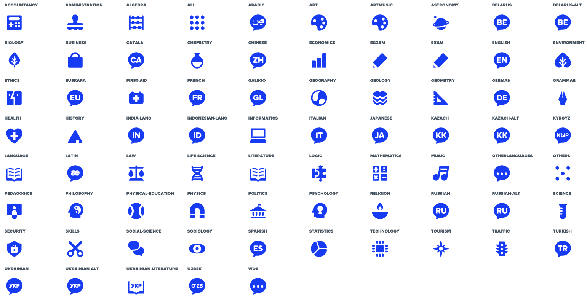
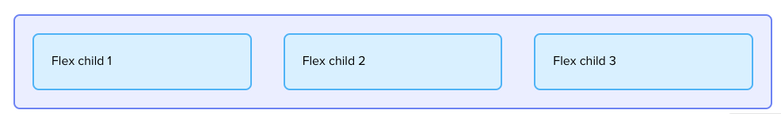
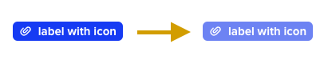

# April 2022 StyleGuide newsletter

Combined update notes, summarising changes in the style guide since the last newsletter (since the StyleGuide v208.2.0). Some of the key highlights include:

- [Storybook deployment and preview for each PR now available](#storybook-deployment-and-preview-on-a-PR-🚀)
- [MDX docs in storybook](#mdx-documentation-📖)
- [Box now supports responsive props](#box-responsive-props-💻)
- [Responsive props documentation](#responsive-props-documentation-💻)
- [New subject icons](#new-subject-icons-✨)
- [New notification favicons](#new-notification-favicons-🔔)
- [Components updates](#components-updates-📦)
- [Engineering](#engineering-🛠)

## Storybook deployment and preview on a PR 🚀

We have added Storybook deployment for each pull request!

You can verify, if your recent changes on the branch were deployed, by checking status of GitHub check. You can preview your changes to the StyleGuide, by clicking on the `Details` link.



The url is constructed out of the branch name:

```
https://style-guide.brainly.com/branch/<YOUR-BRANCH-NAME>/
```

so, for branch called `new-subject-icons` the Storybook preview will be build under:

```
https://style-guide.brainly.com/branch/new-subject-icons/
```

## MDX documentation 📖

We are gradually switching over to MDX documentation in the Storybook.
MDX gives us full control compared to Storybook’s auto-generated documentation. It allows us to customize docs with our own components and to keep both documentation and stories in a single file. Because we can include other MDX files within a MDX file, you can now see accessibility section in documentation of some components in Storybook!

This is an ongoing process aimed to be achieved in this quarter (Q2 2022).

List of converted components stories:

`Accordion, Avatar, Breadcrumbs, Box, Bubble, Buttons, Card, Counter, Dialog, Dropdowns, FileHandler, FlashMessage, Flex, Footer, Header, HomeButton, Icon, Label, Layout, List, Logo`

## Box responsive props 💻

- Added responsive props support to the Box component for the following props:

  - border
  - noBorderRadius
  - padding
  - shadow



## Responsive props documentation 💻

Responsive props makes easy to declaratively set prop value for multiple screen sizes. [Documentation page](https://style-guide.brainly.com/?path=/docs/foundation-%E2%9C%A8-responsive-props--page) was added to Foundation:


Missing responsive props documentation was added for the following components:

- [Subheadline](https://style-guide.brainly.com/?path=/docs/components-subheadline--default-story#responsive-props)
- [Headline](https://style-guide.brainly.com/?path=/docs/components-headline--default-story#responsive-props)
- [Text](https://style-guide.brainly.com/?path=/docs/components-text--default-story#responsive-props)
- [Flex](https://style-guide.brainly.com/?path=/docs/components-flex--default-story#responsive-props)

## New subject icons ✨

All of the subject icons (including mono subject icons) were redesigned, as a follow up of our rebranding that has started last year.

You can see some of the icon files are duplicated, because some icons file names were changed and we didn't want to introduce breaking changes to the application and various markets at that stage.

You can find a list of all icons [here](https://style-guide.brainly.com/?path=/story/components-subjecticon--types).





## New notification favicons 🔔

New notification favicons were added. Because the notification indicator overflows the logotype, all favicons had to be adjusted to account for that space.

Examples of new notifications favicons for each market:

<p float="left">
  
  
  
  
</p>

## Components updates 📦

### Flex



- Flex `margin`, `marginTop`, `marginBottom`, `marginLeft` and `marginRight` props now support `none` value, which sets margin value to 0px.

#### Accessibility improvements

- added basic accessibility test (axe)

### Link

#### Accessibility improvements

- `onClick` action accessibility improvements
- added new tab indicator and `hideNewTabIndicator` prop
- Link now supports passing `target` prop, one of: `'_self' | '_blank' | '_parent' | '_top'`
- new tab label can now be passed as `newTabLabel`

### Text, Headline, Subheadline, TextBit

#### Accessibility improvements

- new tags `strong`, `em`, `del`, `ins`, `q` and `blockquote` added to text components (Text, Headline, Subheadline, TextBit) with proper styling:
  - `font-weight: 700` for `strong` and `b` set globally
  - `font-weight: 900` in TextBit
  - `font-style: normal` for `em` in text components
  - `margin: 0` for `blockquote` in text components

### Label

- Changed Label solid color from indigo-50 to indigo-40

  

### Dropdown

- Added `onItemSelect` handler to the Dropdown

### Dialog

- Added `data-testid` prop for both Dialog and DialogCloseButton components, for testing purposes.
- Adjusted fullscreen Dialog animation - increased transition distance and duration, so it is more visible to the users that the Dialog actually appears over the page.
- Prevent Dialog scrollbars from showing up during show transition - issue with Dialog scrollbars that were causing unexpected shift during show animation was fixed.
- Fixed unimplemented transitionEnd event - firing `onEntryTransitionEnd` and `onExitTransitionEnd` callbacks was fixed for environments, that don't support transition events, e.g. the JSDOM and some older browsers.
- Fixed removing Dialog no-scroll class - no-scroll body class is now removed before `onExitTransitionEnd` callback is fired.

### Box

#### Accessibility improvements

- added basic accessibility test (axe)

### Icons

#### Accessibility improvements

- removed icon titles in browser tooltips

### SeparatorHorizontal and SeparatorVertical

#### Accessibility improvements

- `separator` role added
- `aria-orientation` added

### Breadcrumbs

#### Accessibility improvements

- added accessibility documentation
- added basic accessibility test (axe)

### Bubble

#### Accessibility improvements

- added basic accessibility test (axe)

### Card

#### Accessibility improvements

- added basic accessibility test (axe)

## Engineering 🛠

### gulp-sass upgrade

Upgraded `gulp-sass` and switched to `dart-sass`. Replaced deprecated `/` operator that was used for divisions within `.scss` files with `math.div()`.
