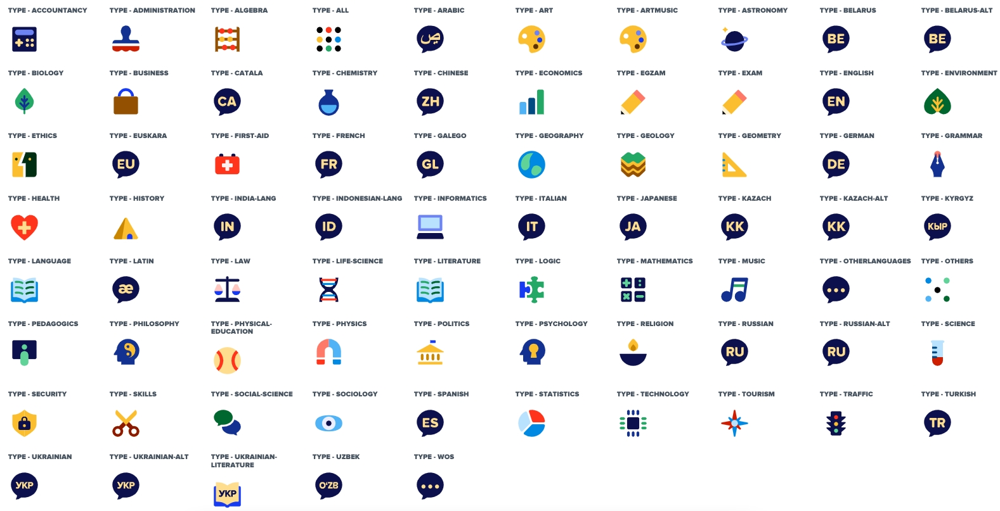
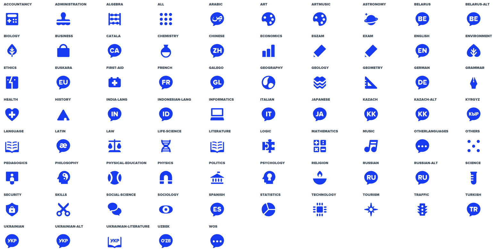

# April 2022 StyleGuide newsletter

Combined update notes, summarising changes in the style guide since the last newsletter (since the StyleGuide v208.2.0). Some of the key highlights include:

- [Storybook deployment and preview for each PR now available](#storybook-deployment-and-preview-on-a-PR)
- [Dialog improvements](#dialog-improvements)
- [Added responsive props to the Box](#box-responsive-props)
- [Responsive props documentation for components](#responsive-props-documentation)
- [Added new subject icons](#new-subject-icons)
- [Added new notification favicons](#new-notification-favicons)
- [Components accessibility improvements](#accessibility-improvements)
- [MDX docs in storybook](#mdx-documentation)
- [Added support for `none` value for Flex margins](#flex-component-changes)
- [Upgraded gulp-sass and switched to dart-sass](#gulp-sass-upgrade)
- [Solid Label color change](#label-component-changes)
- [Added onItemSelect handler to the Dropdown](#dropdown-component-changes)

## Storybook deployment and preview on a PR

We have added Storybook deployment for each pull request!

You can verify, if your recent changes on the branch were deployed, by checking status of GitHub check. You can preview your changes to the StyleGuide, by clicking on the `Details` link.


The url is constructed out of the branch name:

```
https://style-guide.brainly.com/branch/<YOUR-BRANCH-NAME>/
```

so, for branch called `new-subject-icons` the Storybook preview will be build under:

```
https://style-guide.brainly.com/branch/new-subject-icons/
```

## Dialog component improvements

There were a lot of improvements made to the Dialog component since its release.

- Added `data-testid` prop for both Dialog and DialogCloseButton components, for testing purposes.
- Adjusted fullscreen Dialog animation - increased transition distance and duration, so it is more visible to the users that the Dialog actually appears over the page.
- Prevent Dialog scrollbars from showing up during show transition - issue with Dialog scrollbars that were causing unexpected shift during show animation was fixed.
- Fixed unimplemented transitionEnd event - firing `onEntryTransitionEnd` and `onExitTransitionEnd` callbacks was fixed for environments, that don't support transition events, e.g. the JSDOM and some older browsers.
- Fixed removing Dialog no-scroll class - no-scroll body class is now removed before `onExitTransitionEnd` callback is fired.

## Box responsive props

Added responsive props support to the Box component for the following props:

- border
- noBorderRadius
- padding
- shadow

Read more at [Box documentation](https://style-guide.brainly.com/?path=/docs/components-box--default-story).

## Responsive props documentation

Missing responsive props documentation was added for the following components:

- [Subheadline](https://style-guide.brainly.com/?path=/docs/components-subheadline--default-story)
- [Headline](https://style-guide.brainly.com/?path=/docs/components-headline--default-story)
- [Text](https://style-guide.brainly.com/?path=/docs/components-text--default-story)
- [Flex](https://style-guide.brainly.com/?path=/docs/components-flex--default-story)

## New subject icons

All of the subject icons (including mono subject icons) were redesigned, as a follow up of our rebranding that has started last year. You can see some of the icon files are duplicated, because some icons file names were changed and we didn't want to introduce breaking changes to the application and various markets at that stage. You can find a list of all icons [here](https://style-guide.brainly.com/?path=/story/components-subjecticon--types).



## New notification favicons

New notification favicons were added. Because of the notification indicator overflows the logotype, all favicons had to be adjusted to account for that space.

Examples of new notifications favicons for each market:


## Accessibility improvements

- Link
  - `onClick` action accessibility improvements
  - added new tab indicator
    - Link now supports passing `target` prop, one of: `'_self' | '_blank' | '_parent' | '_top'`
    - new tab label can now be passed as `newTabLabel`
- icons
  - removed icon titles in browser tooltips
- Separators
  - `separator` role added
  - `aria-orientation` added
- a11y docs in [Storybook](https://style-guide.brainly.com/) for various components

## MDX documentation

We are gradually switching over to MDX documentation in the Storybook.
MDX gives us full control compared to Storybook’s auto-generated documentation. It enables us to customize docs with our own components and allows to keep documentation and stories in one file.
This is an ongoing process aimed to be achieved in this quarter.

## Flex component changes

- Flex `margin`, `marginTop`, `marginBottom`, `marginLeft` and `marginRight` props now support `none` value, which sets margin value to 0px.

## gulp-sass upgrade

Upgraded gulp-sass and switched to dart-sass (#2342). Replaced deprecated `/` operator that was used for divisions within with math.div.

## Label component changes

- Changed Label solid color from indigo-50 to indigo-40 (#2335)

## Dropdown component changes

- Added onItemSelect handler to the Dropdown #2327
