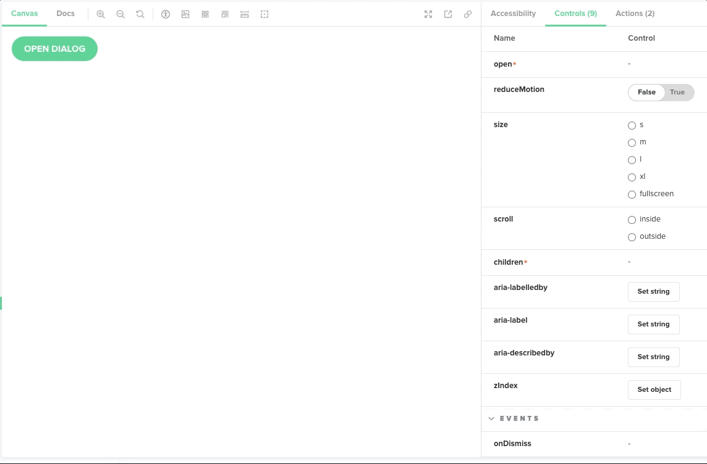
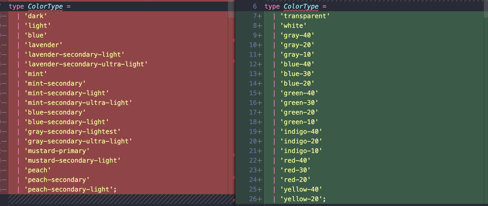
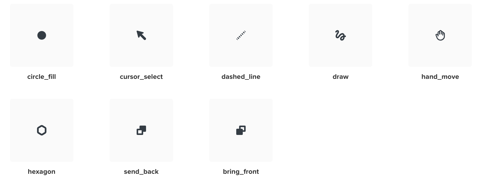
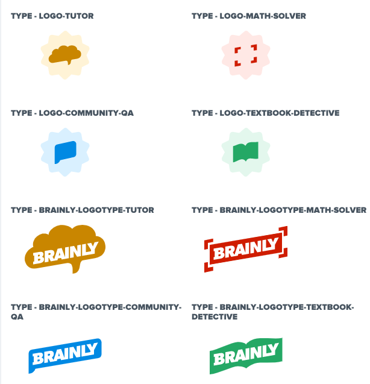
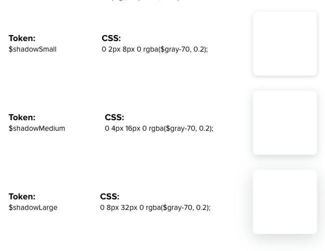
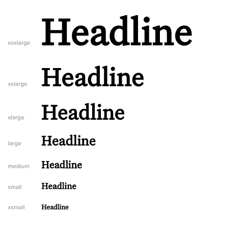

# February 2022 StyleGuide newsletter

Combined update notes, summarising changes in the style guide from a recent month. This is the first edition of the newsletter, so we decided to include features from a longer period. Some of the key highlights include:

- [New Dialog component](#dialog-component)
- [Components accessibility improvements](#accessibility-improvements)
- [Components color API changes](#components-color-api-changes) - caused by introduction of new color tokens.
- [Responsive props](#responsive-props) - added responsive props support to Flex and text components.
- [UX motion tokens](#ux-motion) - added UX motion duration and easing functions tokens.
- [Elevation in the UI](#elevation-in-the-ui) - added shadow tokens.
- [Codemods](#codemods) - CLI for running code modification scripts.
- [New Subheadline component](#subheadline-component)

## Dialog component

New [Dialog](https://style-guide.brainly.com/?path=/story/components-dialog--default) component released.



## Accessibility improvements

Following components were refactored in terms of accessibility:

- Rating
  - Star uses radio input and has accessible label
  - Rating has accessible descriptions for current rate value and rate action
- HomeButton
  - `aria-*` props renamed to use aria naming convention
  - `aria-label` added for a link (defaults to `type`)
  - `altTag` renamed to `alt`
- Logo
  - `alt` defaults to `type`
- FlashMessage
  - `alert` role added
- Avatar
  - focus style is visible
  - new props: `alt` & `ariaLinkLabel`
- Icon
  - added accessible `title` & `description` props for `Icon`
  - added `role` to `svg` in `Icon` (default: `"img"`)
  - adjusted colors for high contrast mode (only Windows)
- AccordionItem
  - added role `heading` and prop `headingLevel`

Detailed accessibility documentation for each component in [Storybook](https://style-guide.brainly.com/) is coming soon.

## Components color API changes

We made color API changes, which were caused by introduction of new [color tokens](https://style-guide.brainly.com/?path=/story/foundation-%E2%9C%A8-colors--page). Breaking changes in following components:

- Icon
- MobileIcon
- SubjectIcon
- MathSymbol
- IconAsButton
- Text
- TextBit
- Link
- Headline
- Bubble
- Box
- Label
- CardHole
- Spinner, SpinnerContainer
- Counter
- Overlay
- FileHandler
- Media
- Separators

Example of `Box` colors API changes (old ones on the left, new ones on the right):



The `Button` component will be updated with the new colors after the experiment phase, although the component itself is already consuming new color tokens internally.

## New icons

There was a bunch of new icons added in recent releases:

Mobile: `circle_fill`, `cursor_select`, `dashed_line`, `draw`, `hand_move`, `hexagon`, `send_back`, `bring_front`.



Desktop: `bulb`, `bulb_checked`, `envelope`, `keyboard`, `profile_settings`, `answers`, `google`, `apple`.


## Responsive props

Added responsive props support to following components:

- Flex
- Headline
- Subheadline
- Text
- Link
- Textbit

It enables passing multiple of values for prop depending on screen width. There are two notations supported - array and object one.

In the object notation, breakpoints keys are: 'sm', 'md', 'lg', 'xl'. All keys are optional.
Example of usage:

```jsx
<Flex marginLeft={{sm: 's', lg: 'l'}}>content</Flex>
```

HTML result would be:

```html
<div class="sg-flex sg-flex--margin-left-s lg:sg-flex--margin-left-l">
  content
</div>
```

In the array notation, breakpoints are: 'sm', 'md', 'lg', 'xl'. Breakpoints order has to be preserved, but they are all optional, so the value can be null or undefined.

```jsx
<Flex marginLeft={['s', 'm', null, 'l']}>content</Flex>
```

HTML result would be:

```html
<div
  class="sg-flex sg-flex--margin-left-s md:sg-flex--margin-left-m xl:sg-flex--margin-left-l"
>
  content
</div>
```

List of supported responsive props:

- fullWidth
- fullHeight
- noShrink
- inlineFlex
- alignItems
- alignContent
- justifyContent
- wrap
- wrapReverse
- alignSelf
- direction
- margin
- marginTop
- marginBottom
- marginLeft
- marginRight

Detailed documentation on this feature is coming soon.

## UX motion

New UX motion tokens, including durations and easing functions were added to the SG. You can find recommended usage for each token [here](https://style-guide.brainly.com/?path=/story/foundation-%E2%9C%A8-ux-motion--page).

Live examples of transitions are to be added in the future, for now please refer to [the Pencil documentation](https://design.brainly.com/8adfd5f36/p/091f75-ux-motion/b/5018fa) for visual representation of animations.

## Product logotypes

Introduced new [product logos and logotypes](https://style-guide.brainly.com/?path=/story/components-logo--product-logos).



## Elevation in the UI

Created [shadows utility classes](https://style-guide.brainly.com/?path=/story/utilities-shadows--page) and [documentation of elevation levels](https://style-guide.brainly.com/?path=/docs/foundation-%E2%9C%A8-shadows--page).



## Codemods

We created a CLI tool that runs codemods with [jscodeshift](https://github.com/facebook/jscodeshift) to batch refactor code.
Usage:

```sh
yarn sg-codemod [...options]
```

Read more about codemods [here](../CODEMODS.md).

Included Transforms:

#### `replace-colors-rebranding`

Replaces `color` prop on a component to match new color tokens and/or refactored component API.


## Subheadline component

[Subheadline](https://style-guide.brainly.com/?path=/story/components-subheadline--sizes) component was created for marketing use only. Do not apply it on product pages and in the mobile application. Because of this component, the `Untitled` serif font face was added.


