# August 2022 StyleGuide newsletter

Combined update notes, summarising changes in the style guide since the last newsletter (since the StyleGuide v213.3.0). Some of the key highlights include:

- [Storybook as an official documentation](#-storybook-as-an-official-documentation)
- [Beta releases](#-beta-releases)
- [Transition component](#-transition-component)
- [Reduced motion support](#-reduced-motion-support)
- [Buttons rebranding](#-buttons-rebranding)
- [Colors CSS variables](#-colors-css-variables)
- [New Checkbox, Radio and RadioGroup components](#-new-checkbox-radio-and-radiogroup-components)
- [Components updates](#-components-updates)

## 🚀 Storybook as an official documentation

We have fully switched to Storybook, so from now on it's one and only source of truth about the StyleGuide! Our new docs are line with brand guidelines and provide better experience.

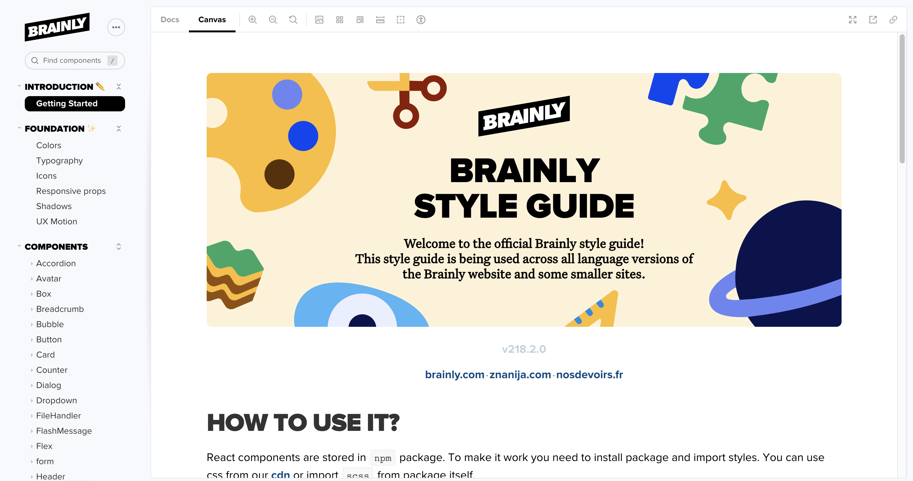

## 🚀 Beta releases

Did you ever want to try some new feature out, before making changes to the whole StyleGuide? Now you can! You can release the StyleGuide as a beta version, which also includes assets.

To release a beta version, you need to change the version in the package.json and add a git tag. The version has to contain `-beta.0` at the end. So it should, for example, look like this: `219.0.1-beta.0`. When you want to publish next version of beta, increment the `.0` to `.1` and so on.

To update the `package.json` and git tag in one go run such command:

```
npm version 219.0.1-beta.0
```

To publish the beta version to npm just run the following command:

```
npm publish --tag beta
```

## 🪄 Transition component

You can now use Transition component to easily introduce CSS transitions and animations on a React component when it enters or leaves the DOM.

There's a bunch of predefined effects, such as: `fade`, `scaleFade`, `slideUpFade`, `slideDownFade`, `slideLeftFade` and `slideRightFade`.

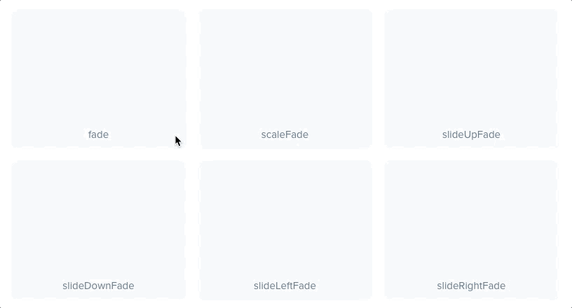

You can also find more sophisticated examples of movements and transitions.

Curved movement:

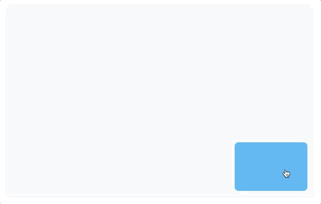

Shared axis:

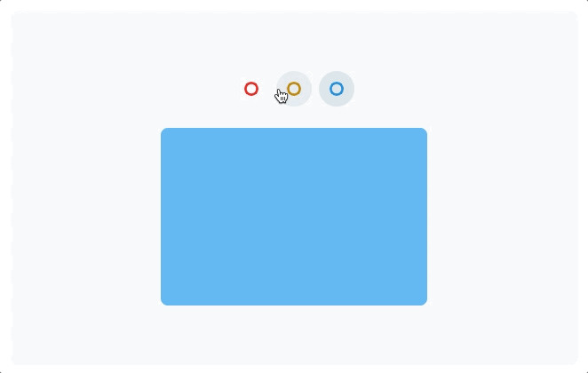

List:

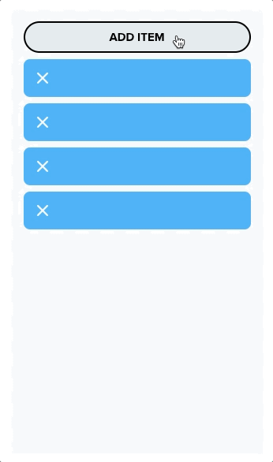

Transition component fully supports reduced motion. Please see [full documentation](https://styleguide.brainly.com/219.0.1/docs/?path=/docs/components-transition--default-story) to find more examples, including code samples.

## 😵‍💫 Reduced motion support

We've added a `useReducedMotion` hook, that detects the user motion preference. When user prefers seeing reduced motion on their screen, you should adjust animations accordingly. See [documentation](https://styleguide.brainly.com/219.0.1/docs/?path=/story/utilities-usereducedmotion--page).

## 🛎 Buttons rebranding

We changed our buttons not only as a result of rebranding, but also to increase accessibility and make product CTA's more intuitive. New system for buttons was created, with updated colors, limited styles and clear guidelines of usage.

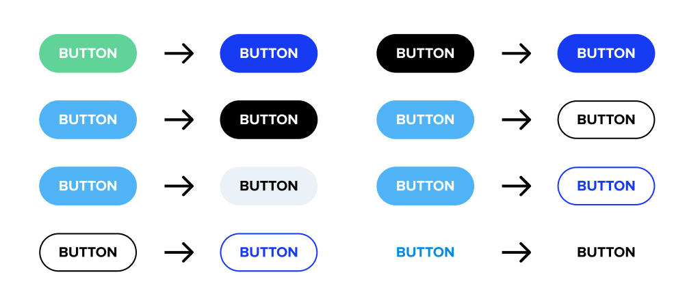

## 🎨 Colors CSS variables

All StyleGuide colors are now accessible as CSS variables as well!

We removed colors declaration from the `_config.scss` file and generate CSS and SASS color variables during build process from `src/components/colors/colors.js` file. Thanks to this change, there's now only one source of truth for all colors in the StyleGuide.

## 🔘 New Checkbox, Radio and RadioGroup components

We have created accessible [Checkbox](https://styleguide.brainly.com/219.0.1/docs/?path=/story/components-form-checkbox--default-story), [Radio](https://styleguide.brainly.com/219.0.1/docs/?path=/story/components-form-radio--default-story) and [RadioGroup](https://styleguide.brainly.com/219.0.1/docs/?path=/story/components-form-radio-group--default-story) components. New features include: light and dark color types, custom themes, error messages, descriptions, UX motion and custom wrappers support!

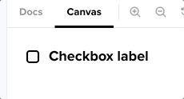

## 📦 Components updates

### SkipLink

A keyboard-functional "skip" link was created to allow keyboard users to navigate directly to the main content, as it rarely comes first in a typical layout. Before users can arrive at the main content, they must skip past features like the website's logo, navigation and branding.

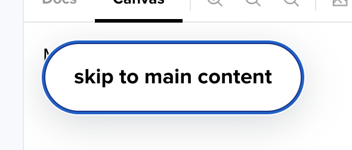

### Input

New size S was added to the Input component.

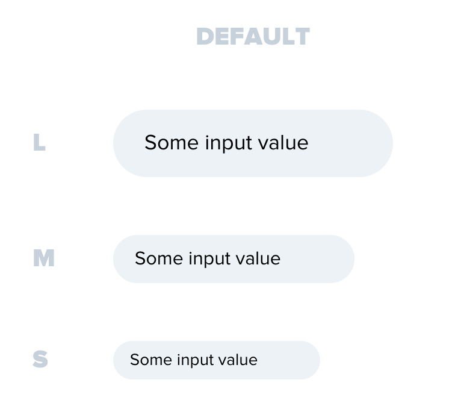

### Select

New size S was added to the Select component.

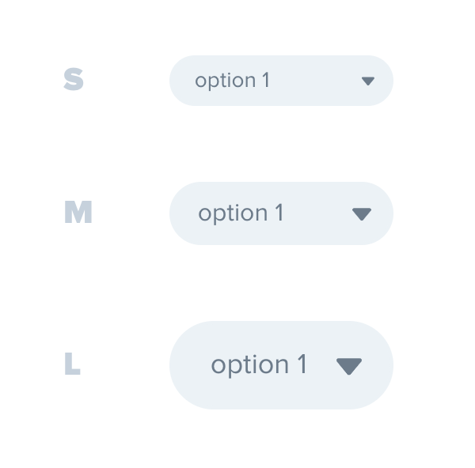

### Counter

Counter accessibility was improved, including darkening colors for better contrast ratio.

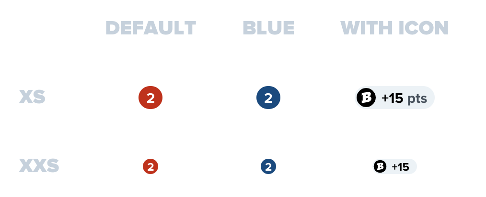

### Label

`<Label type="solid/>` needed to be altered to meet WCAG requirements on color contrast, as only achromatic color was accessible. There were also several accessibility improvements, such as rename of `iconHidden` to `iconAriaHidden`.

Before:

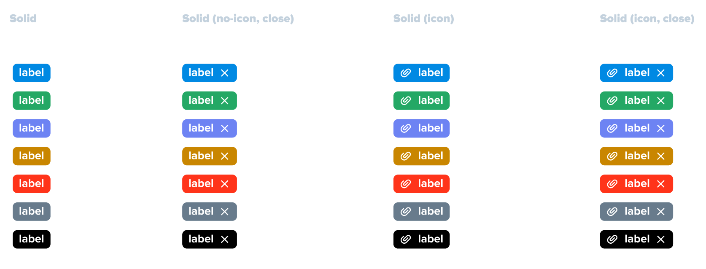

After:

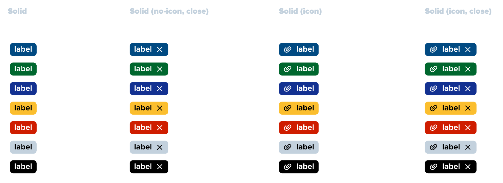

### Icons

Added new desktop icons: `collapse`, `cursor_select`, `eraser`, `caret_down`, `caret_up`, `multiselect`.

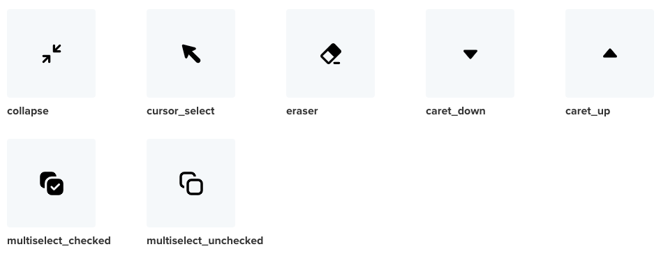

Added new mobile icons: `bookmark`, `unbookmark`, `bookmark_outlined`.

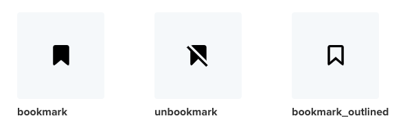

Arrows and chevrons standarisation - renamed `arrow` icons to `chevron` icons and added new arrow icons.

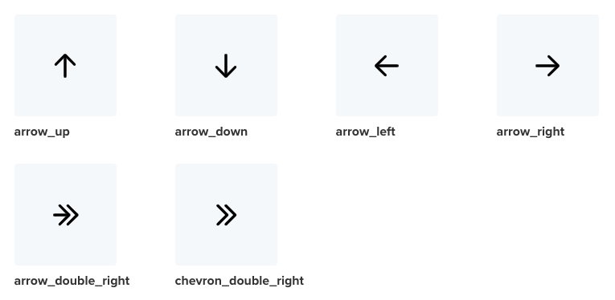

### Header

Header was deprecated.

### Footer

Footer component was not used in the Brainly web app at all, so we decided to remove it.

### Accordion

- improved transitions in Accordion
- enabled adding tooltips to AccordionItem

### Text, Headline, Subheadline, TextBit, Link

- added a11y documentation for `Text`, `TextBit`, `Headline`, `Subheadline`
- added short a11y documentation in typography page
- axe tests for `Text`, `TextBit`, `Headline`, `Subheadline`
- accessibility of typography linked in `Link` documentation

### Button

- can be now assigned a native HTML type, one of: `'button'`, `'submit'` and `'reset'`.
- can be now assigned a target type
- added a11y documentation and tests
- switched to default cursor
- stories converted to mdx
- added accessible information about loading state
- added accessible information about opening a new tab when target="\_blank" is provided
- `disabled` fixes
- added documentation for toggle button
