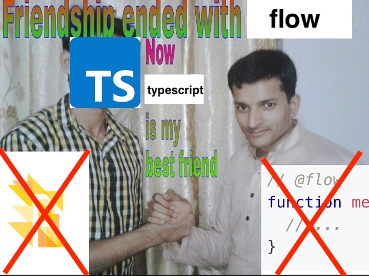
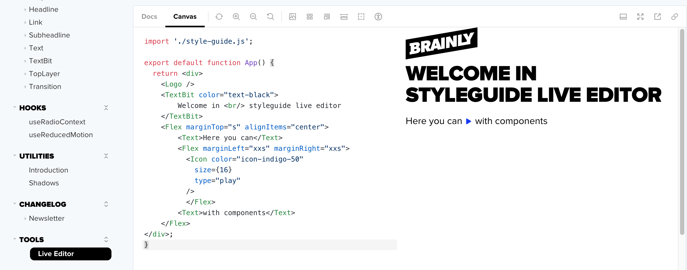
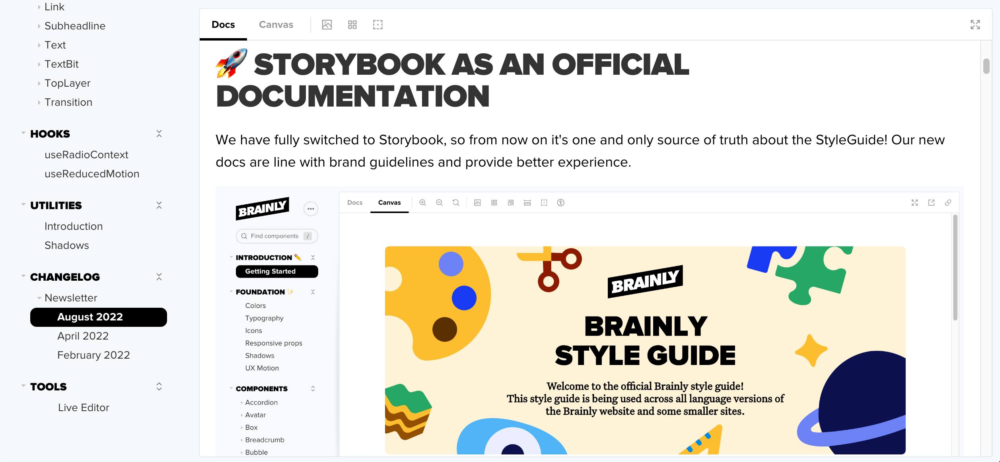
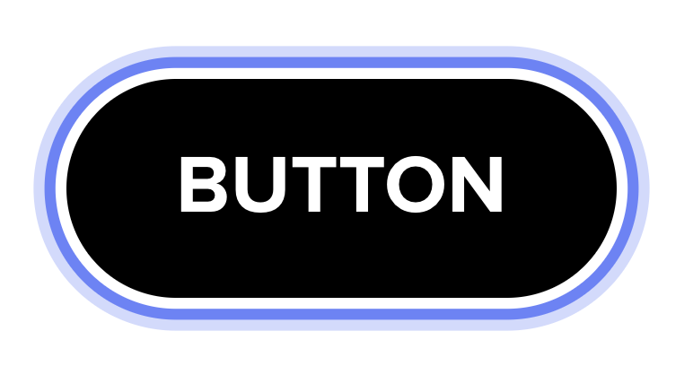
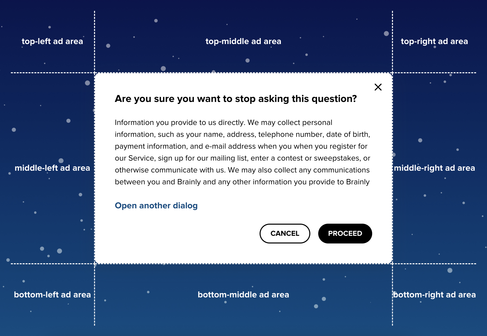
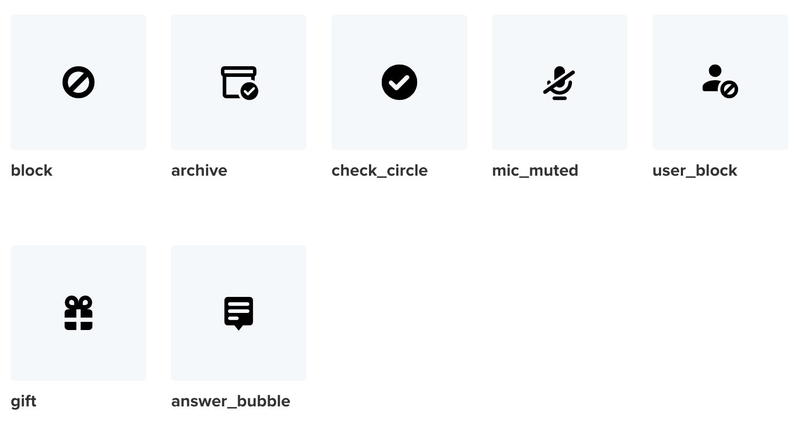
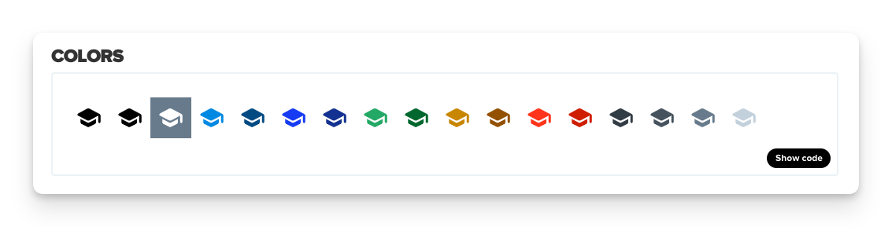
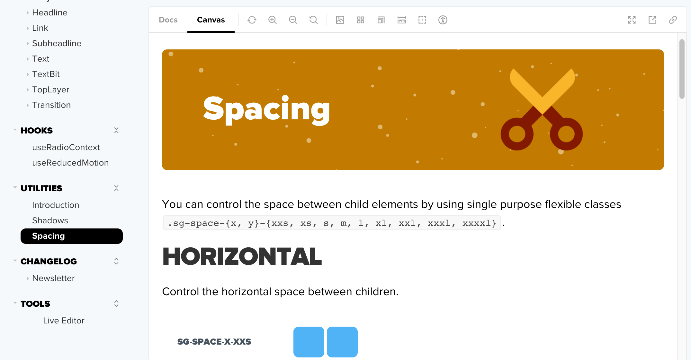

# January 2023 StyleGuide newsletter

Combined update notes, summarising changes in the style guide since the last newsletter (since the StyleGuide v219.1.0). Some of the key highlights include:

- [TypeScript migration](#-typescript-migration)
- [StyleGuide Live Editor](#-styleguide-live-editor-beta-version)
- [Newsletter in storybook](#-newsletter-in-storybook)
- [Focus style](#-focus-style)
- [Dialog for ads](#-dialog-for-ads)
- [StyleGuide Metrics](#-styleguide-metrics)
- [Components updates](#-components-updates)
- [Engineering](#-engineering)

## 🏷 TypeScript migration

We have successfuly migrated the whole repository from Flow to TypeScript!

## 🖊 StyleGuide Live Editor (beta version)

We've created a [live editor inside the storybook](https://styleguide.brainly.com/docs/?path=/story/tools-live-editor--live-editor), so you don't have to run StyleGuide on your local environment to be able to test out StyleGuide components! This tool is in beta version and is to be improved in the future.

## 📰 Newsletter in storybook

You can now access our newsletter editions in the storybook. These pages are dynamically created upon the build process, so we have one source of truth for our newsletter, that can be easily accessed in github, but at the same time exist in the storybook!

## 👆 Focus style

We've added two types of focus - default one, called `focusStyle` and one used for inline, wrapped elements called `focusTextStyle`.

Components using `focusStyle`: `Accordion`, `Avatar`, `Button`, `Dialog`, `FileHandler`, `HomeButton`, `IconAsButton`, `Label`, `Rating`, `Search`, `SkipLink`, native interactive elements besides `<a>`.

  

Components using `focusTextStyle`: `Link`, `Dropdown`, native `<a>`.

  

There are also new mixins available:

- `applyFocusStyle` & `applyFocusTextStyle` - only with focus style
- `applyFocus` & `applyFocusText` - with rules when focus should be visible

Focus colors can be changed by overwriting following css variables: `--focusColorOuter`, `--focusColor`, `--focusColorInner`.

## 🖼 Dialog for ads

We have reworked Dialog layout so it holds slots for ads.

## 📈 StyleGuide Metrics

We've created an internal tool that visualizes StyleGuide components usage.

## 📦 Components updates

### Icons:

- added new desktop icons: `block`, `archive`, `check_circle`, `mic_muted`, `user_block`, `gift` and `answer_bubble`.

- colors shade 60 was added for icon colors:

### Accordion

- added responsive props
- animations no longer play on items expanded by default
- increased performance of expanding and focusing Accordion items
- added `aria-label` and `aria-labelledby` to Accordion

### Button

- `type` prop renamed to `variant` and `nativeType` renamed to `type`. This change allows the developer to use the `type` attribute of the native button element.
- added high contrast mode for Button

### Dialog

- added `appearance` attribute which allows disabling Dialog container style
- added `motionPreset` attribute, which allows disabling motion styles, so there is no animation on the Dialog enter
- fixed DialogOverlay typescript types
- fixed Dialog not closing when user clicks on the overlay
- fixed focus trap
- fixed Dialog and Transition not to break SSR

### Radio, RadioGroup

- added `useRadioContext` hook documentation and the hook export
- improved RadioGroup documentation
- extended `style` attribute type, so it supports css variables overrides
- made possible to use RadioGroup as a controlled component
- do not apply Radio animation until either Radio checked state or RadioGroup value is changed

### Checkbox

- changed Checkbox label display to inline
- fixed Checkbox tick animation on Safari and Firefox
- extended `style` attribute type, so it supports css variables overrides
- Checkbox animation does not play until either checked state is changed

### Rating

- changed icon type, spacings and UI of active state

### List

- added a11y docs, tests and improvements
- list now can be ordered or unordered

### Overlay

- added a11y docs and tests

### Layout

- added `as` atrribute to enable adding semantics
- accessibility documentation and basic test

### Select

- added `forwardRef` support

### Input

- fixed Input size S error message styling
- fixed Input losing focus after error message is displayed

### HomeButton

- changed HomeButton `type` to accept only Brainly's market logos

### Subheadline

- fixed invalid font weight

### Textarea

- fixed Textarea losing focus after error message is displayed

## 🛠 Engineering

- updated Storybook to v6.5
- updated CONTRIBUTING.MD documentation with beta release description
- added spacing documentation
  
